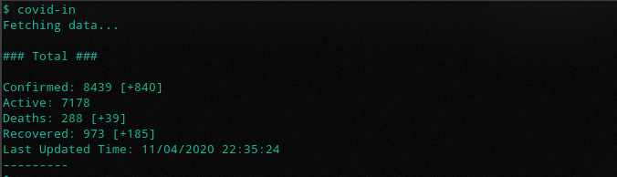
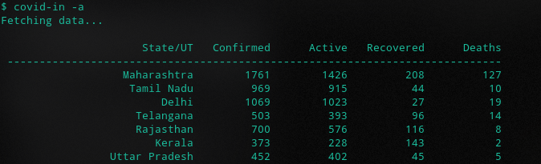
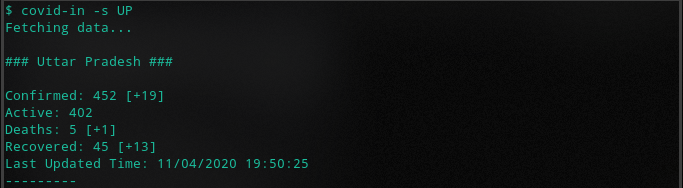

# covid-in

A command line app to get covid-19 update.

## Installation

```sh
$ git clone https://github.com/aayush-jaiswal/covid-in.git
$ cd covid-in/
$ make
```

To install it in /usr/local/bin/ and use it globally run the following command
```sh
$ sudo make install
```

### Dependencies
[libcurl](https://curl.haxx.se/docs/install.html)

Install on Ubuntu based distro
```sh
$ sudo apt install libcurl4-openssl-dev
```


## Usage

* Get overall updates
```sh
$ covid-in
```

* Show help
```sh
$ covid-in -h
```

* Show statecodes
```sh
$ covid-in --statecodes
```

* Get stats of specific state or multiple states
```sh
$ covid-in -s [statecode]
```
OR 
```sh
$ covid-in -s [statecode seperated by comma]
```

## Screenshots





## TODOs

- [x] Add option to show tested data 
- [x] Show delta changes
- [ ] Add option to show district data
- [ ] Better output formatting
- [ ] Add option to show data in tabular form
- [ ] Add option to show top 10
- [ ] Add sort option according to key 

### Data Source

https://www.covid19india.org/